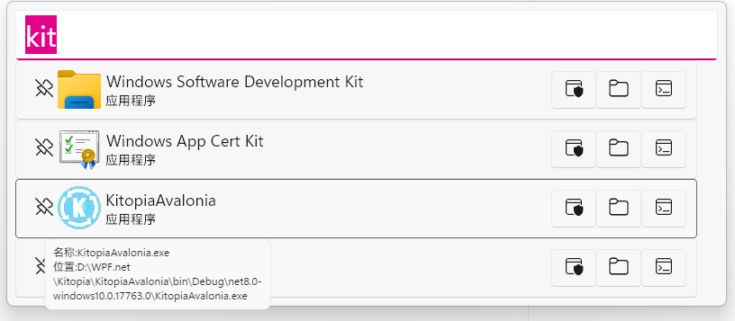

# Kitopia 开源 自由 插件化 节点化的工具集合
### 注意仍在开发中功能并不完善

## 项目介绍
### 功能

#### 搜索框 (默认快捷键`Alt+空格`)
1. 快速打开本地项目(常规软件和UWP软件)  
    (以管理员身份运行,打开程序所在文件夹,在命令行打开程序所在路径)  
    支持与`Everything`集成快速打开本地文档
    
2. 快速打开桌面文件和文件夹
    
3. 快速打开本地路径(剪贴板自动检测/手动输入)
    
4. 快速打开网页/在网页中搜索
    
5. 快速执行命令
    
6. 快速保存剪贴板图像到图像文件
    
7. 简单的数学计算
    
8. 运行Kitopia情景
    
### 截图工具 (默认快捷键`Ctrl+Alt+Q`)
#### 对屏幕内容进行截取
1. 两种截图模式 
    - 截取后直接复制到剪贴板
    - 截取后进行图像批注/修改
2. 图像批注(需在设置中关闭直接复制到剪贴板)
   
    - 可用工具 矩形框 圆形框 箭头 画笔 文字 马赛克
    - 可调整颜色 粗细 大小
    - 可拖动已有的图形(马赛克除外)
    - 可撤销操作
### 鼠标快捷操作 (默认快捷键长按`鼠标侧键2`)
1. 快速打开本地项目

### 插件化平台
1. 提供SDK支持插件化开发,拓展软件功能(当然直接PR在主程序也是一种方式)
2. 提供用户可方便配置的界面
   
### 情景(自己的专属功能)
#### 编写自己的情景来调用Kitopia软件自身的功能,以及来自插件的拓展功能
1. 节点可视化编辑,无需编写代码,直接拖拽节点来编写自己的情景
    

### 已知问题
1. 与Everything集成且索引未完成时无法搜索